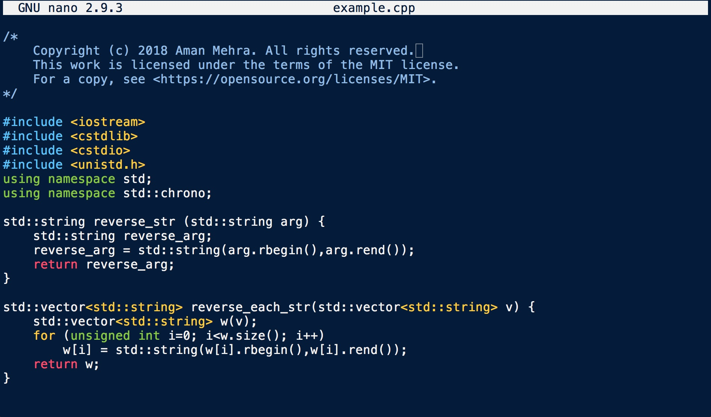

# Tangaroa-Dark
Mac OS terminal theme with dark tangaroa background inspired by gnome theme Elio from http://mayccoll.github.io/Gogh/.

In the screenshot.jpeg, I have opened an example source file in GNU nano editor https://www.nano-editor.org.

To install the theme do the following: Download this repo > unzip it > open Terminal > Shell > Import... > select Tangaroa Dark.terminal from unzipped folder.
